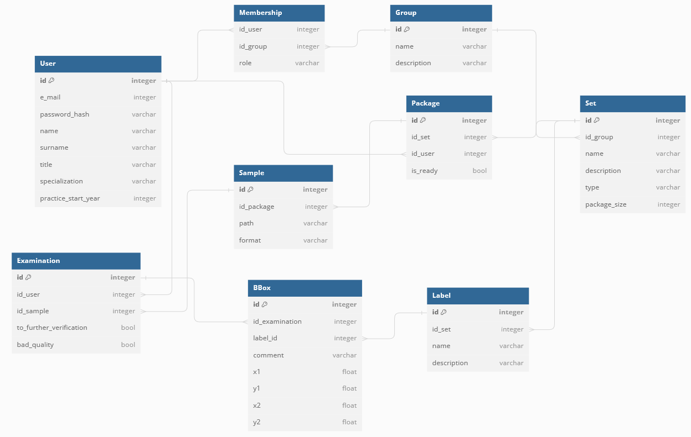
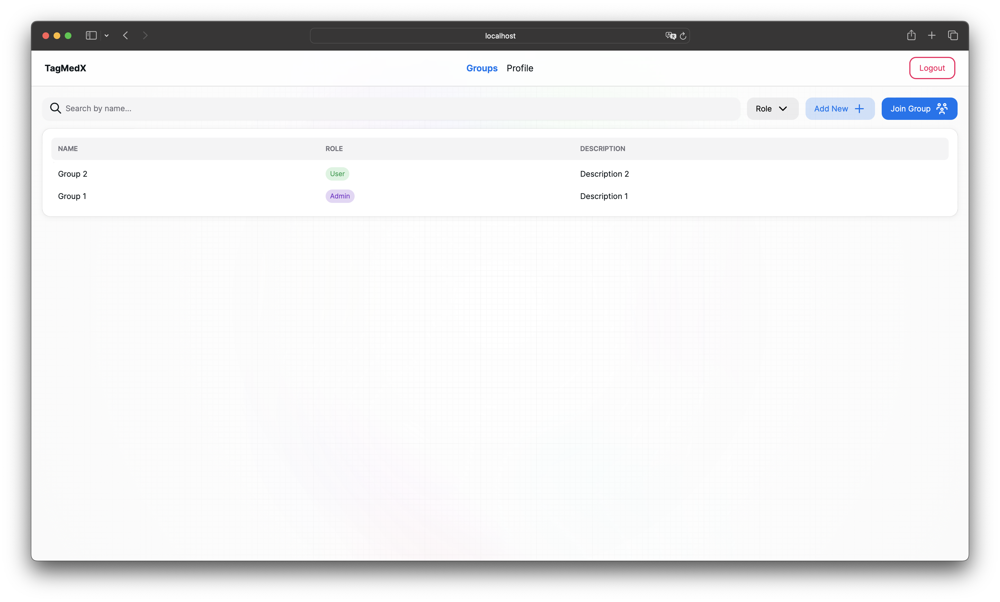
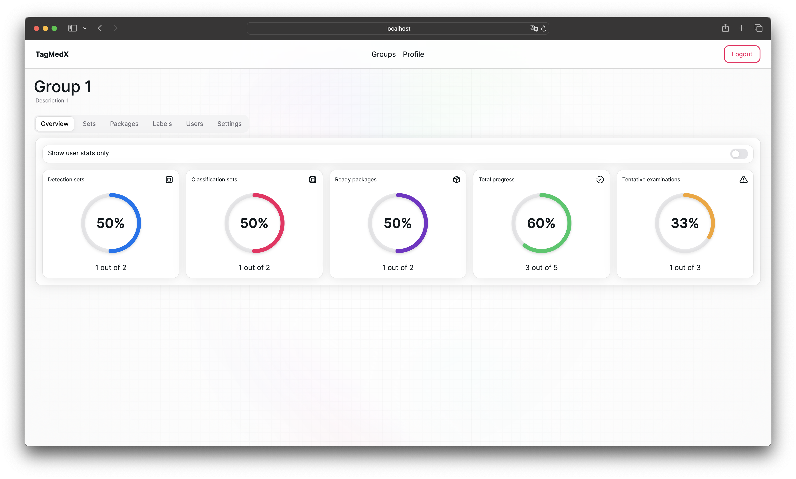
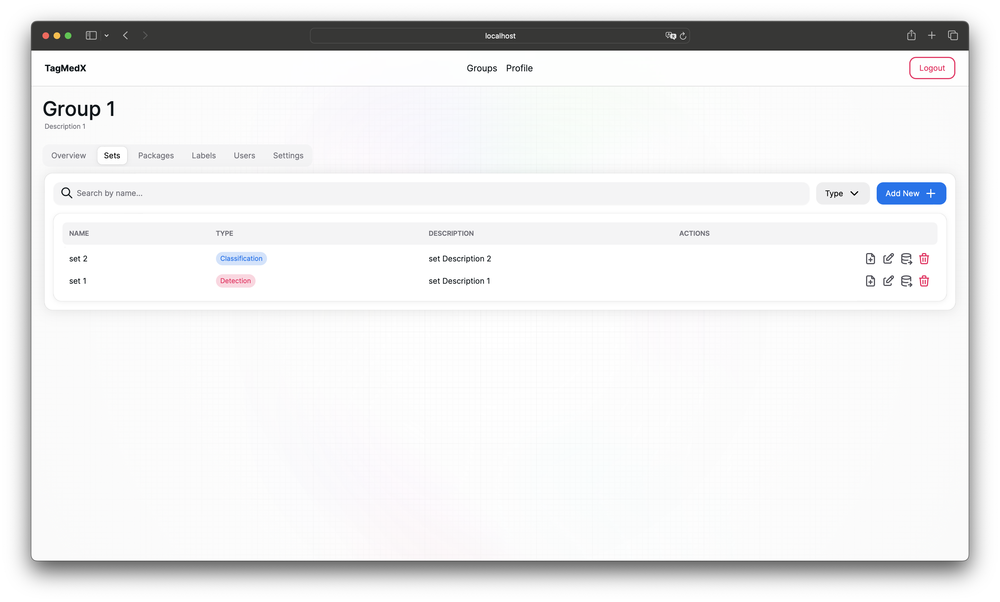
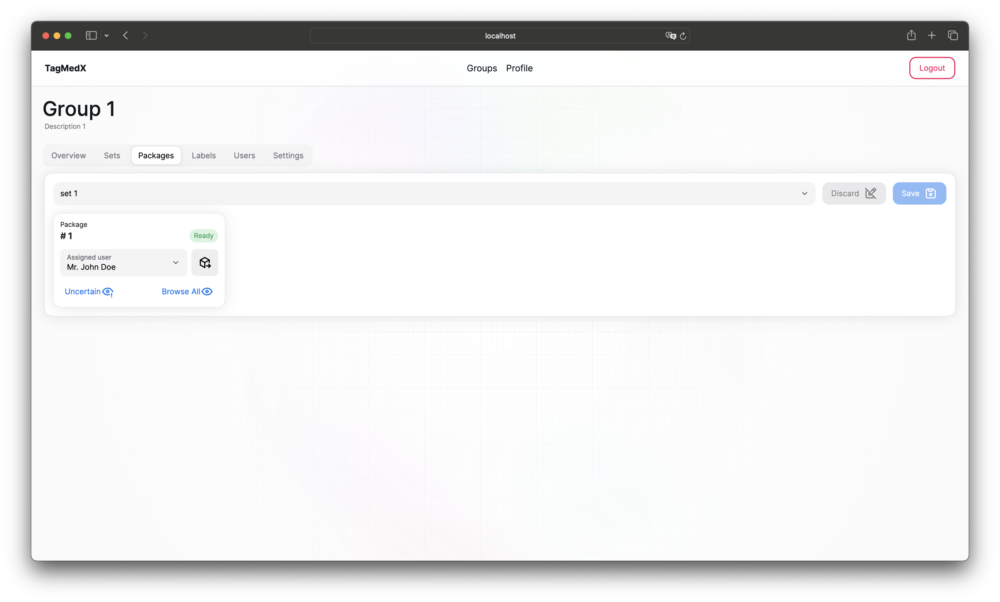
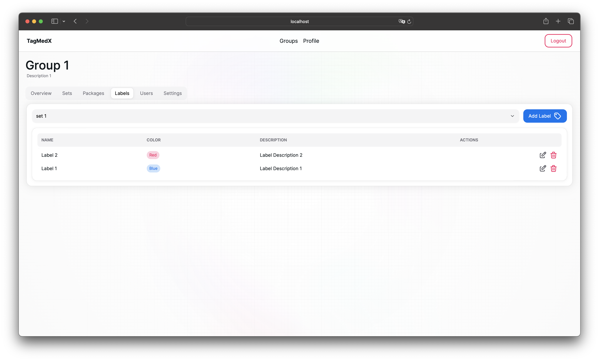
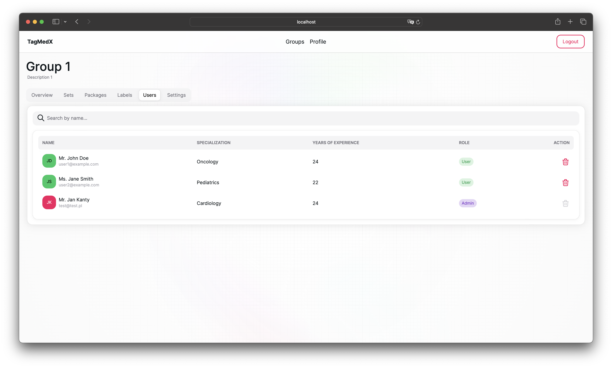
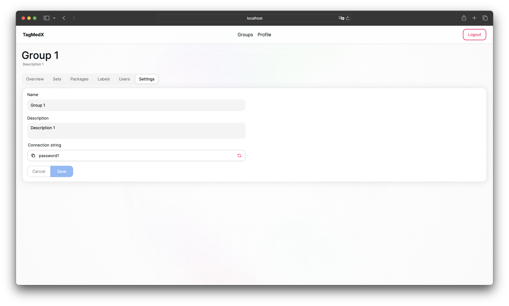

# TagMedX: Open-Source Medical Image Annotation 🏥

TagMedX is an open-source web app built with FastAPI, Next.js, and MySQL, designed for medical image tagging – both classification and detection. It's a tool for healthcare professionals, such as doctors and medical experts, to annotate medical images remotely for AI systems.

## 🚀 Quickstart

```bash

git clone https://github.com/heyimjustalex/TagMedX.git
cd TagMedX

```

Start without frontend, just backend, DB, and DBAdmin

```bash
docker-compose up --build
```

Start whole project (with frontend)

```bash
docker-compose -f docker-compose_all.yml up --build
```

## Project dependencies

- Database - mysql:8.1.0
- Database Admin Panel - phpmyadmin:5.2.1
- Backend (FastAPI) - python:3.8 - (additional dependencies in ./backend/requirements.txt)
- Frontend (Next.js + TS) - node:20 - (additional dependencies in ./frontend/package.json)

## Database

SQL file in /DB/setup.sql (with some random data loading). <br> In /DB folder there are also screenshots of scheme and dbdiagram.io code if modification of scheme is needed. <br>
Scheme might also be viewed in PHPMyadmin



### Structure

The structure of the database is as follows:

**User:**

- Fields: id, e_mail, password_hash, name, surname, title, role, description, experience
- Purpose: Represents a doctor or an admin who controls datasets.
- Relationships:
  - One-to-Many with Membership
  - One-to-Many with Examination
  - One-to-Many with Package

**Group:**

- Fields: id, name, description
- Purpose: Represents a group or team of users that will work on a specific dataset. For example, a group of dentists marking a teeth dataset.
- Relationships:
  - One-to-Many with Set
  - One-to-Many with Membership

**Membership:**

- Fields: id_user, id_group
- Purpose: Represents the membership of users in groups.
- Relationships:
  - Many-to-One with User
  - Many-to-One with Group

**Set:**

- Fields: id, id_group, name, description, type
- Purpose: Represents sets that are created by users with the role "admin/manager." A Group is linked with Set, allowing a group of doctors to have many sets assigned. Set is a representation of activity dataset marking.
- Relationships:
  - Many-to-One with Group
  - One-to-Many with Package (each set has multiple packages)
  - One-to-Many with Label (a set has some labels assigned by the admin, which doctors can later choose from)

**Package:**

- Fields: id, id_set, id_user, is_ready
- Purpose: Represents sets that are created by users with the role "admin/manager." A Group is linked with Set, allowing a group of doctors to have many sets assigned. Set is a representation of activity dataset marking.
- Relationships:
  - Many-to-One with Set (Package belongs to a Set (previously called Task))
  - Many-to-One with User (Package has user that owns it)
  - One-to-Many with Sample (each Package has multiple Samples)

**Sample:**

- Fields: id, id_set, path, format
- Purpose: Represents samples, which contain information about added photos to be examined.
- Relationships:
  - Many-to-One with Package
  - Many-to-One with User - each sample has a user that it was firstly assigned to
  - One-to-Many with Examination - each sample might have different examination by different users, with different BBox

**Examination:**

- Fields: id, id_user, id_sample, tentative, bad_quality
- Purpose: Records information about Sample Examination by User (doctor). It might involve detection or classification. If it's classification, there is just one bounding box (BBox).
- Relationships:
  - Many-to-One with User
  - Many-to-One with Sample
  - One-to-Many with BBox (during a single Sample Examination by a particular User, they might crop some data on the Sample with one BBox or with many, depending on the type of sample)

**Label:**

- Fields: id, id_set, name, description
- Purpose: Represents labels for sets that are constrained by the admin/manager who creates the Set.
- Relationships:
  - Many-to-One with Set
  - One-to-Many with BBox

**BBox:**

- Fields: id, id_examination, id_label, comment, x1, y1, x2, y2
- Purpose: Stores bounding box details. The coordinates x1, y1 represent the bottom-left corner, and x2, y2 represent the top-right corner.
- Relationships:
  - Many-to-One with Examination
  - Many-to-One with Label

## Backend

### General

Project has hot-reload with Docker and it gets started with compose. Written with FastAPI.

### Naming conventions

1. Use typing and linter.
2. Try to stick to PEP8.

- Methods: snake_case
- Classes: PascalCase

### Project structure

Backend project is divided into 3 main folders: features, models, repositories. Features have user-domain specific folders like groups, users or sets. Each of these subfolders has it's own controllers, schemas and services. Some facts:

- If you want to make new feature make new folder in feature folder
- Models are mapped to MySQL database entities defined in /DB/setup.sql. Any change made to model any of these means the other needs to be changed.
- Backend is dockerized and avaliable at localhost:8000 (You can test endpoints users/1 or /users)

```
├── backend                   <- FastAPI backend
│   ├── features              <- Domain specific features
|   |   ├── exceptions        <- Our defined exceptions
|   |   |   ├── definitions   <- Exceptions definitions (used by services)
|   |   |   ├── handlers      <- Excaptions hanlders used by app.py
|   |   ├── examination       <- Sample examination related features
|   |   ├── groups            <- Group related features
|   |   ├── sets             <- Sets related features
|   |   ├── users             <- Users related features
|   |   |   ├── controllers   <- Router and endpoints /users /users/id
|   |   |   ├── schemas       <- Pydantic schemas for response
|   |   |   ├── services      <- Layer talking to Repositories
│   ├── models                <- SQLAlchemy data models
│   ├── repositories          <- SQLAlchemy queries
│   ├── utilities             <- Utilities like database connector or session
│   ├── requirements.txt      <- Packages to install
│   ├── Dockerfile            <- Dockerfile for Docker image
```

<br>

### Requirements.txt Python packages

- **FastAPI (0.103.1)**: A fast web framework for building APIs with automatic documentation.
- **SQLAlchemy (2.0.21)**: A powerful SQL toolkit and ORM for Python.
- **aiomysql (0.2.0)**: An asyncio driver for MySQL databases.
- **Pydantic (2.4.2)**: Data validation and parsing library for Python.
- **Uvicorn (0.23.2)**: A lightweight ASGI server for asynchronous Python web apps.
- **mysql-connector-python (8.1.0)**: A Python driver for MySQL databases.
- **mysqlclient**: A MySQL database adapter for Python.

### Useful links

https://levelup.gitconnected.com/structuring-fastapi-project-using-3-tier-design-pattern-4d2e88a55757 <br>
https://github.com/fastapi-practices/fastapi_best_architecture <br>
https://github.com/zhanymkanov/fastapi-best-practices#2-excessively-use-pydantic-for-data-validation <br>

## Frontend

### General

Project has hot-reload with Docker and it gets started with command:

```bash
docker-compose -f docker-compose_all.yml up --build
```

### Technologies

- Next.js
- TypeScript
- Tailwind CSS
- NextUI

### Naming conventions

1. Components functions and files should start with capital letter.
2. Every component file should be in folder with the same name.
3. Component folder should contains no more than 4 files:

- **component.css** - component styling
- **Component.tsx** - component
- **ComponentConsts.ts** - component consts
- **ComponentUtils.ts** - component utils (functions)

<br>

- Components: camelCase, function() {}
- Functions: camelCase, function() {}
- CSS classes: dash-case (ex. class-name\_\_sub-class--variant)

### Project structure

Frontend source folder is divided into 7 main folders: app, assets, components, consts, contexts hooks and utils. App folder defines app structure. Assets stores media files. Components contains subfolders with components. Consts folder is intended for global consts and interfaces. Contexts includes React contexts and providers. Hooks folder contains React hooks. In utils folder utility functions can be found. Frontend is dockerized and avaliable at localhost:3000.

```
├── frontend                  <- Next.js frontend
│   ├── src                   <- Source folder
|   |   ├── app               <- App structure
|   |   ├── assets            <- Media folder
|   |   ├── components        <- Components folder
|   |   ├── consts            <- Consts folder
|   |   ├── contexts          <- Contexts and Providers folder
|   |   ├── hooks             <- React hooks folder
|   |   ├── utils             <- Utility functions folder
│   ├── public                <- Media folder
│   ├── next.config.js        <- Next.js config
│   ├── package.json          <- Packages to install
│   ├── tsconfig.json         <- TypeScript config
│   ├── tailwind.config.json  <- Tailwind CSS config
│   ├── Dockerfile            <- Dockerfile for Docker image
```

<br>

## Git workflow

### Branches

In order to start developing, please create your own branch:
`git checkout -b "<type>/<branch-name>"`

- Type: feature, fix, build, chore, ci, docs, style, refactor, test
- Name: dash-case

ex. feature/login-page

### Commits

Please use following commits name convention:
`<type>: commit name`

- Type: feature, fix, build, chore, ci, docs, style, refactor, test
- Name: lowercase

ex. feature: add login button

### Pull request

Please use following pull request name convention:
`<Type>: commit name`

- Type: Feature, Fix, Build, Chore, CI, Docs, Style, Refactor, Test
- Name: lowercase

ex. Feature: add login page
<br>
Additionally list in pull request description main changes.

### Merging

⚠ Use squash and merge ⚠

## Screenshots











